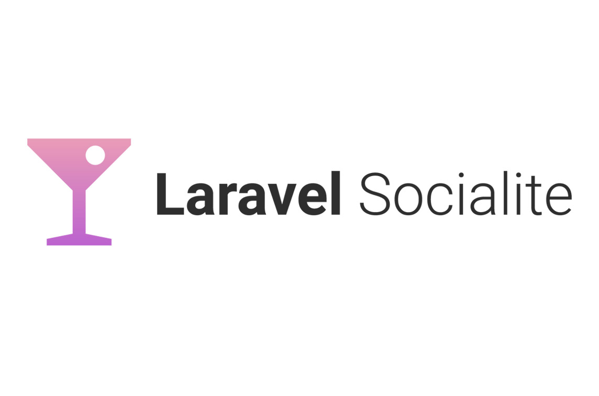
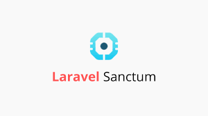
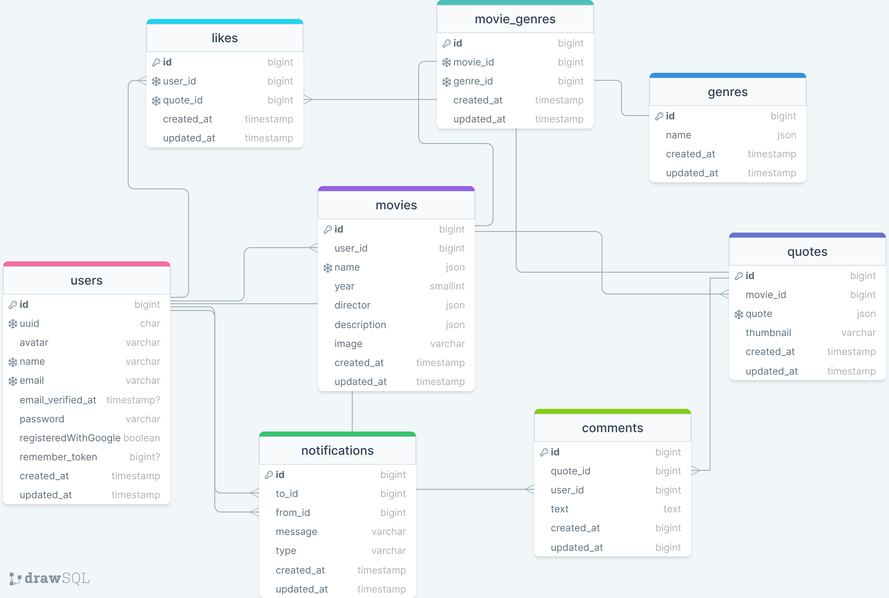

# Movie Quotes

This is Movie Quotes Website! platform where users can explore, contribute, and engage with a vast collection of movie quotes in both Georgian and English languages. Whether you're a movie enthusiast or just looking for some memorable lines.
#
### Table of Contents
* [Prerequisites](#prerequisites)
* [Tech Stack](#tech-stack)
* [Getting Started](#getting-start)
* [Migrations](#migration)
* [Development](#development)
* [Project Structure](#project-structure)

#
### Prerequisites

*  *PHP@8.2 and up*
*  *MYSQL@8 and up*
*  *npm@9.6 and up*
*  *composer@2.6 and up*

#
### Tech Stack
*  [Laravel@10.x](https://laravel.com/docs/10.x) - back-end framework
*  [tailwind@3.3](https://tailwindcss.com/docs/guides/laravel) - CSS framework
*  [Spatie Translatable](https://github.com/spatie/laravel-translatable) - package for translation
*  [pusher@8.x](https://pusher.com/docs/) - Real-time event broadcasting and notification system
*  [Laravel Socialite@5.6](https://laravel.com/docs/10.x/socialite) - OAuth authentication library for integrating with social media platforms
*  [Laravel Sanctum@3.2](https://laravel.com/docs/10.x/sanctum) - Laravel package for API authentication via API tokens

#
### Getting Start

1\. First of all you need to clone Movie Quote app repository from github:
```sh
git clone git@github.com:RedberryInternship/nikoloz-gogua-movie-quotes-back.git
```
2\. Next step requires you to run *composer install* in order to install all the dependencies.
```sh
composer install
```
3\. after you have installed all the PHP dependencies, it's time to install all the JS dependencies:
```sh
npm install
```
4\. Now we need to set our env file. Go to the root of your project and execute this command.
```sh
cp .env.example .env
```
And now you should provide **.env** file all the necessary environment variables:

5\. Create link for storage:
```sh
php artisan storage:link
```

#
**MYSQL:**
>DB_CONNECTION=mysql

>DB_HOST=127.0.0.1

>DB_PORT=3306

>DB_DATABASE=*****

>DB_USERNAME=*****

>DB_PASSWORD=*****
 
**PUSHER:**
>BROADCAST_DRIVER=pusher

>PUSHER_APP_ID=****

>PUSHER_APP_KEY=****

>PUSHER_APP_SECRET=****

>PUSHER_PORT=443

>PUSHER_SCHEME=https

>PUSHER_APP_CLUSTER=****

**Google Oauth:**
>GOOGLE_CLIENT_ID=******

>GOOGLE_CLIENT_SECRET=******

>GOOGLE_REDIRECT_URI=******


after setting up **.env** file, execute:
```sh
  php artisan key:generate
```
in order to generate auth key.

##### Now, you should be good to go!

#
### Migration
if you've completed getting started section, then migrating database if fairly simple process, just execute:
```sh
php artisan migrate
```

#
### Development

You can run Laravel's built-in development server by executing:

```sh
  php artisan serve
```

then run vite config:

```sh
  npm run dev
```
it builds css files into executable scripts.

insert genres into database:

```sh
  php artisan insert:genres
```

#
### Project Structure

[Database Design Diagram](https://drawsql.app/teams/nikas-team-2/diagrams/movie-quote-app "Draw.io")


